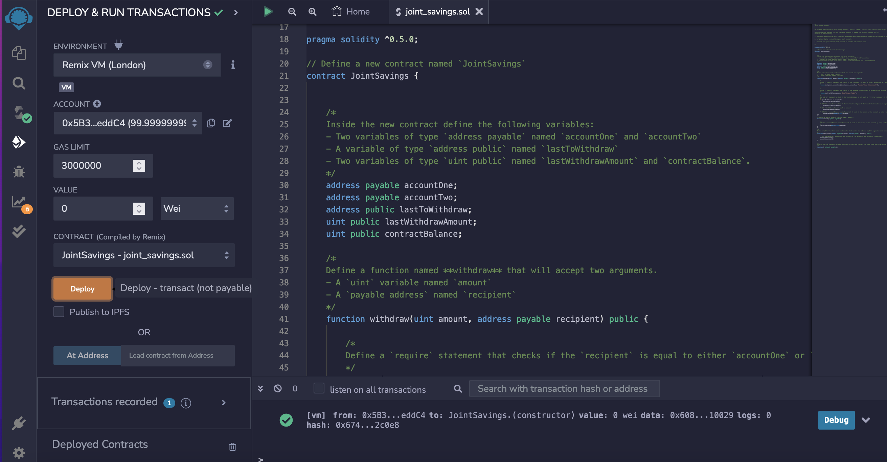
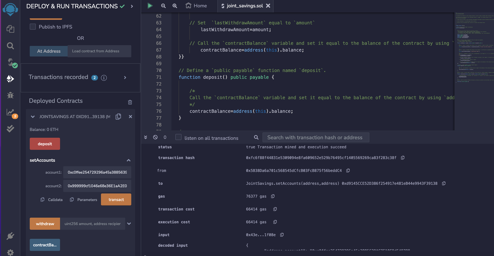
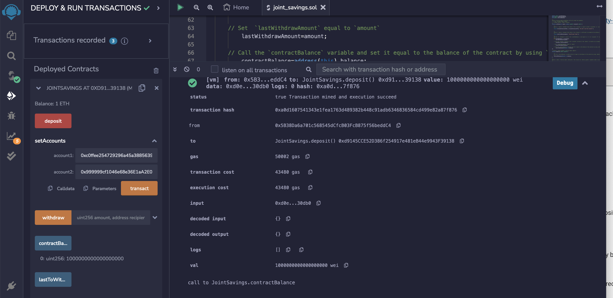
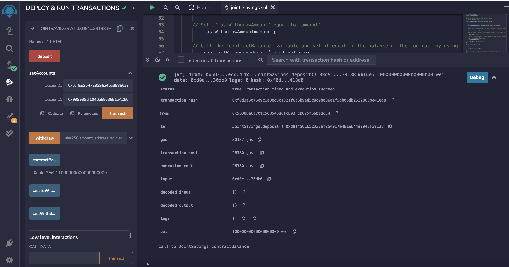
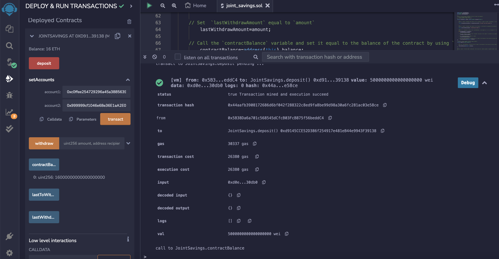
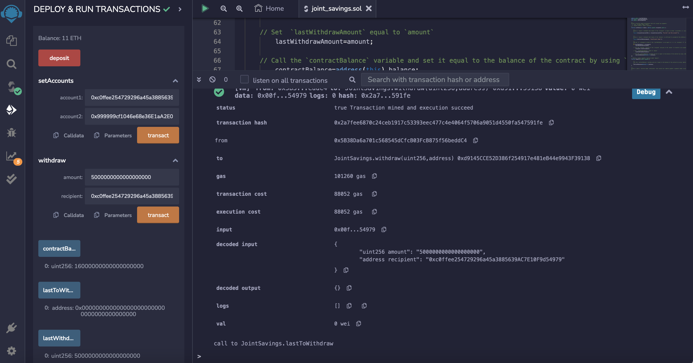
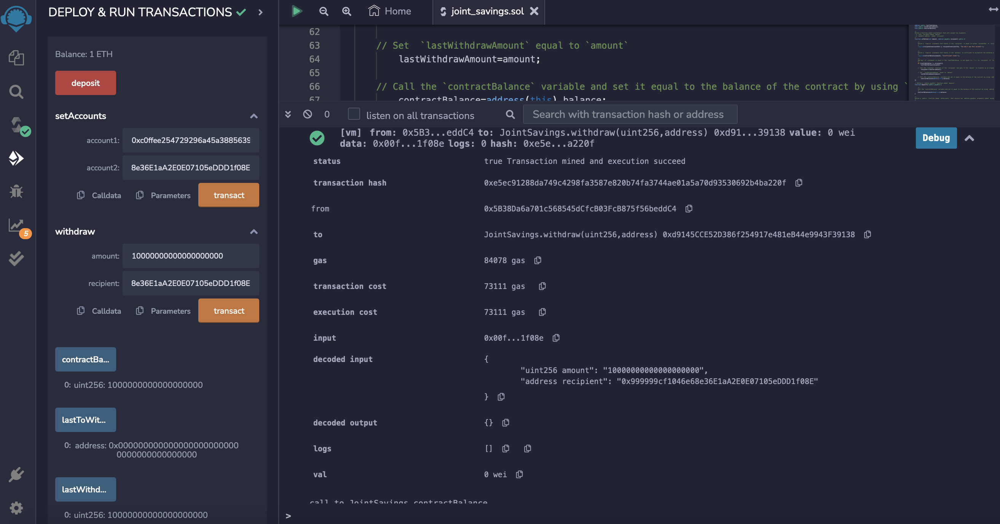

# *Smart Contract with Solidity*
---

**Welcome to my repository for the project creating a Solidity smart contract. Please explore the codebase!**  

>“Online identity and reputation will be decentralized. We will own the data that belongs to us.” – William Mougayar
---
## Analytical Summary

This project creates a Solidity smart contract that accepts two user addresses. These addresses control a joint savings account. This contract allows you to deposit and withdraw funds from the account.

---

## Technologies

This project leverages Solidity compiler 0.5.0 that is run in the Remix IDE https://remix.ethereum.org

---

## Usage

To use this project run the code in Remix, using the compiler 0.5.0 and environment Remix VM (London).

---
## Methodology

First, copy the code into the Remix script. 
Second, compile your smart contract.
Third, in the Remix IDE deploy your smart contract. 
The output should look similar to this image:

You can interact with your smart contract. Set your accounts:

Deposit money on your account:

Withdraw into the accountOne:

and also into the accountTwo:

---

## Contributors

Brought to you by Katerina Gawthorpe.

---

## License

MIT